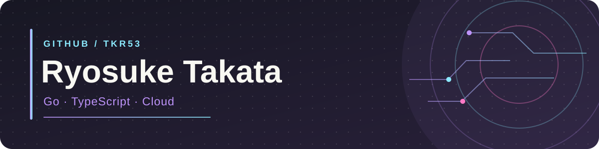
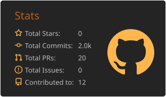
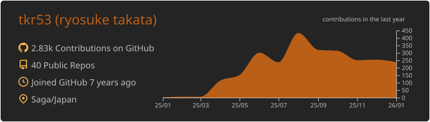

  

  <a href="https://github.com/tkr53">GitHub</a> ·
  <a href="https://zenn.dev/mamuno">Zenn</a>

### 🧰 Tech Stack

<table>
  <tr>
    <td width="50%" valign="top">
      <strong>📝 Languages</strong>  
      
    </td>
    <td width="50%" valign="top">
      <strong>⚙️ Frameworks</strong>  
      
    </td>
  </tr>
  <tr>
    <td width="50%" valign="top">
      <strong>🗄️ Data</strong>  
      
    </td>
    <td width="50%" valign="top">
      <strong>☁️ Cloud & Infrastructure</strong>  
      
    </td>
  </tr>
  <tr>
    <td colspan="2" valign="top">
      <strong>🔧 Tools & Environment</strong>  
      
    </td>
  </tr>
</table>

### 📊 GitHub Stats

  
  

### 📈 Activity

  

### ✍️ Writing on Zenn

  
  
  

  

